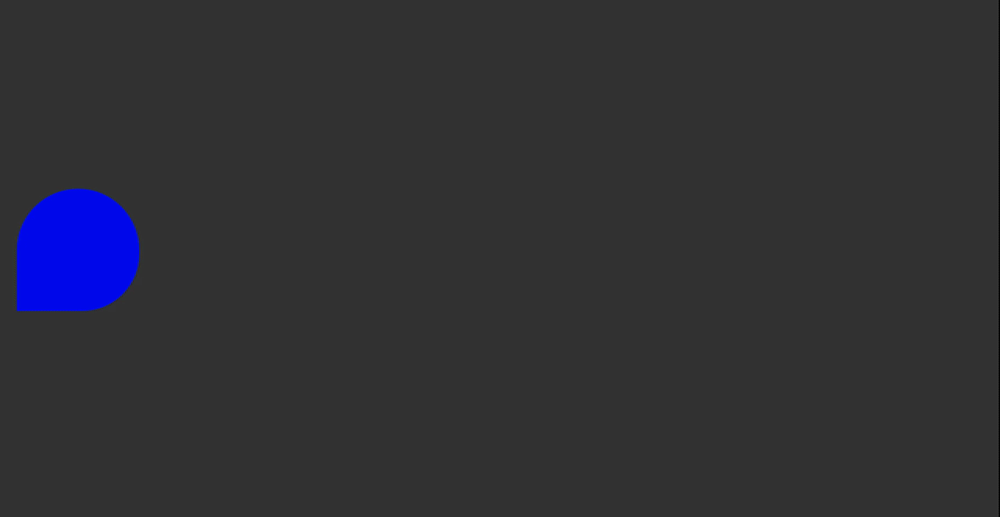
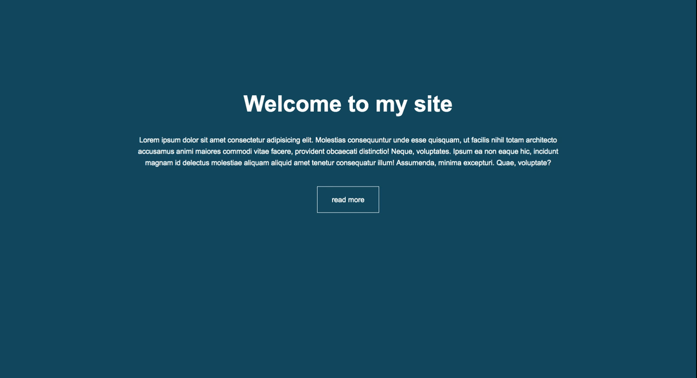

# CSS3 Keyframes & Animations

## animation properties

animation-name: `name it what you want`;

animation-duration - set a duration for it

```html
<body>
  <div class="box"></div>
</body>
```

```css
.box {
  background: #fff;
  width: 200px;
  height: 200px;
  position: relative;
  animation-name: myAnimation;
  animation-duration: 4s;
  animation-iteration-count: 2;
  animation-delay: 2;
  animation-direction: alternate;
  animation-timing-function: ease-in;
}
```

take the name you created `myAnimation` and create a keyframe. Inside specify different points.

## Start at 0%

## Everything else happens within thw start and finish time

## Finish at 100%

```css
@keyframes myAnimation {
  0% {
    background-color: white;
    left: 0px;
    top: 0px;
    border-radius: 0 0 0 0;
  }
  25% {
    background-color: red;
    left: 300px;
    top: 0px;
    border-radius: 50% 0 0 0;
  }
  50% {
    background-color: green;
    left: 300px;
    top: 300px;
    border-radius: 50% 50% 0 0;
  }
  75% {
    background-color: blue;
    left: 0px;
    top: 300px;
    border-radius: 50% 50% 50% 0;
  }
  100% {
    background-color: white;
    left: 0px;
    top: 0px;
    border-radius: 50% 50% 50% 50%;
  }
}
```



---

# Transitions

```html
<body>
  <div class="box"></div>
</body>
```

```css
body {
  background: #333;
}

.box {
  background: white;
  width: 300px;
  height: 300px;
  position: relative;
  margin: auto;
  top: 200px;
  /* all is a shortcut to add them all together*/
  transition-property: background, border-radius, transform;
  transition-duration: 1s, 3s;
  transition-timing-function: ease-in-out;
}

.box:hover {
  background: red;
  border-radius: 50%;
  transform: rotateY(180deg);
}
```


## TRANSITIONAL PROPERTIES

-Properties that have an identifiable halfway point

background-color

background-position

border-color

border-width

border-spacing

bottom

color

font-size

font-weight

height left

letter-spacing

line-height

margin

max-height

max-width

min-height

min-width

opacity

outline-color

outline-offset

outline-width

padding right

text-indent

text-shadow

top

vertical-align

visibility

width

word-spacing

z-index \*/

---

## Landing page

```html
<body>
  <header id="showcase">
    <h1>Welcome to my site</h1>
  </header>
  <div id="content" class="container">
    Lorem ipsum dolor sit amet consectetur adipisicing elit. Molestias
    consequuntur unde esse quisquam, ut facilis nihil totam architecto accusamus
    animi maiores commodi vitae facere, provident obcaecati distinctio! Neque,
    voluptates. Ipsum ea non eaque hic, incidunt magnam id delectus molestiae
    aliquam aliquid amet tenetur consequatur illum! Assumenda, minima excepturi.
    Quae, voluptate?
  </div>
  <a href="#" class="btn">read more</a>
</body>
```

```css
* {
  margin: 0;
  padding: 0;
}

body {
  font-family: Arial, Helvetica, sans-serif;
  background: #12475f;
  color: white;
  line-height: 1.6;
  text-align: center;
}
.container {
  max-width: 960px;
  margin: auto;
  padding: 0 30px;
}

#showcase {
  height: 300px;
}

#showcase h1 {
  font-size: 50px;
  line-height: 1.3;
  position: relative;
  animation: heading;
  animation-duration: 3s;
  animation-fill-mode: forwards;
}

@keyframes heading {
  0% {
    top: -50px;
  }
  100% {
    top: 200px;
  }
}

#content {
  position: relative;
  animation: content;
  animation-duration: 3s;
  animation-fill-mode: forwards;
}

@keyframes content {
  0% {
    left: -1000px;
  }
  100% {
    left: 0px;
  }
}

.btn {
  display: inline-block;
  color: white;
  text-decoration: none;
  padding: 1rem 2rem;
  border: #fff 1px solid;
  margin-top: 40px;
  opacity: 0;
  animation: btn;
  animation-duration: 3s;
  animation-delay: 3s;
  animation-fill-mode: forwards;
  transition-property: transform;
  transition-duration: 1s;
}

.btn:hover {
  transform: rotateY(180deg);
}

@keyframes btn {
  0% {
    opacity: 0;
  }
  100% {
    opacity: 1;
  }
}
```


